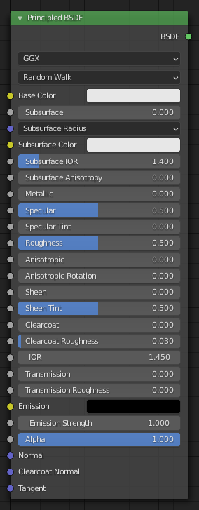
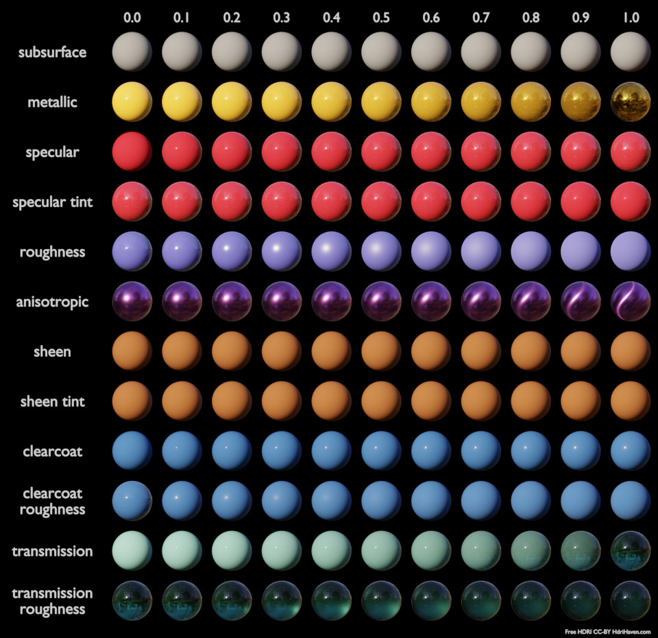

> 参照[官方文档](https://docs.blender.org/manual/zh-hans/3.1/render/shader_nodes/shader/principled.html)学习🙂

## 着色器`shader`

### 原理化BSDF`pricipled BSDF`


自带的eevee和cycles（或cycles-e之类的衍生）渲染器使用的着色器。

> 如果使用octane渲染器，就要用universal material着色器，但基本的着色原理大差不差

### 输入


#### 基础色`Base Color`
漫射或金属表面颜色。


#### 次表面`Subsurface`
漫反射和次表面散射之间的混合。并非漫反射和次表面散射之间的简单混合，而是会与次表面半径的数值进行相乘运算。


#### 次表面半径`Subsurface Radius`
光散射到表面下方的平均距离。较高的半径可以使外观更柔和，因为光线会流入阴影区域并穿过物体。散射距离是针对RGB通道单独指定的，对于具有较强红光散射的皮肤材质，渲染效果较佳。X，Y和Z的数值会分别映射到R，G和B的值。


#### 次表面颜色`Subsurface Color`
次表面基础颜色。


#### 次表面折射率`Subsurface IOR`（只支持cycles）
次表面散射的折射率。


#### 次表面各向异性`Subsurface Anisotropy`（只支持cycles）
控制次表面散射的方向性。


#### 金属度`Metallic`
从无金属到全金属的混合材质模式。数值为1.0时表现为基础颜色叠加完全镜面反射着色，不含任何漫射或透明属性。数值为0.0时材质变现为底层的漫射或透明层样子，但顶部仍保留着一层反射层。


#### 镜面反射`Specular`
非传导性高光反射量。表面沿法线方向的反射率常设定在0-8％范围内。
```text
可以使用下面这个特殊情况下的菲涅耳公式，来计算具有已知折射率的真实材质计算高光值：
    specular = ((ior - 1)/(ior + 1))^2 / 0.08 
例如：
    水: 折射率 = 1.33, 高光 = 0.25
    玻璃: 折射率 = 1.5, 高光 = 0.5
    钻石: 折射率 = 2.417, 高光 = 2.15
由于确实存在反射率高于8％的材料，因此该处允许取值大于1。
```


#### 高光染色`Specular Tint`
使用基础色对朝向面进行高光反射，而镜面反射保持白色。

普通电介质具有无色反射，因此该参数在技术上并不具有物理学上的正确性，但可用于模拟具有复杂表面结构的材质外观。


#### 粗糙度`Roughness`
用于确定漫反射和镜面反射时，物体表面的微平面粗糙度。
```text
从旧版的 光泽 BSDF 着色器节点转换时，应使用原始值的平方根。
```


#### 各向异性过滤`Anisotropic`（只支持cycles）
镜面反射的各向异性量。较高的设定值可提供沿切线方向的细长高光；设定为负值则会给出垂直于切线方向的高光。


#### 各向异性旋转`Anisotropic Rotation`（只支持cycles）
旋转各向异性的方向，取值为1.0时，旋转一周。
```text
与 各向异性 BSDF 着色器节点不同，该节点的高光延伸方向会旋转90°。可通过增加0.25的旋转值进行更正。
```


#### 光泽`Sheen`
边缘附近类似天鹅绒材质的反射数量，用于模拟布料等材质。

- 也可以用于表现人脸或者皮肤上面的汗毛效果，在光照下微微的发光


#### 光泽染色`Sheen Tint`
在白色和基础色之间进行混合，以获得光泽反射效果。


#### 清漆`Clearcoat`
物体顶部的白色高光层。适用于汽车油漆等材质的模拟。


#### 清漆粗糙度`Clearcoat Roughness`
清漆的粗糙度。


#### IOR
折射率。


#### 传递采样`Transmission`
数值设定为0时，表面完全不透明；数值设定为1时，表面为玻璃状。不同的取值代表上述两种状态的混合效果。


#### 透射粗糙度`Transmission Roughness`（只支持cycles）
与 GGX 分布一起，用于控制透射光的粗糙度。


#### 自发光(发射)`Emission`
来自表面的自发光，与自发光着色器类似。


#### 自发光强度`Emission Strength`
发射光的强度。值 1.0 将确保图像中的对象具有与自发光颜色完全相同的颜色，即使其“无阴影”。


#### Alpha
控制表面的透明度，数值设定为1.0时，表面完全不透明。通常连接到 “图像纹理” 着色器节点的Alpha输出接口。


#### 法向`Normal`
控制基础图层的法线方向。


#### 清漆法线`Clearcoat Normal`
控制 清漆 图层的法线方向。


#### 切向(正切)`Tangent`
控制 各向异性 图层的法线方向。


### 属性
#### 分布
- GGX
  - 比 多重散射 GGX 渲染速度快，但不够精确。选择它后，可以启用 透射粗糙度 输入选项。
- 多重散射 GGX
  - 会计算微平面之间的多次反弹和散射。这样就可以使物体不会因为过度变暗而显得突兀。


#### 次表面方法
模拟次表面散射的渲染方式。eevee不支持
- 克里斯坦森-伯利
  - 基于物理的体积散射的近似值。这种方法不如随机游走准确，但是在某些情况下，这种方法会更快地解决噪声。
- 随机游走（固定半径）
  - 为薄而弯曲的物体提供准确的结果。 Random Walk 在网格内部使用真正的体积散射，这意味着它最适合封闭网格。网格中的重叠面和孔可能会导致问题。
- 随机游走
  - 行为类似于随机游走（固定半径），但根据颜色、次表面各向异性和次表面 IOR 调整次表面半径。因此，此方法试图保留比随机游走（固定半径）更多的表面细节和颜色。


### 样例
