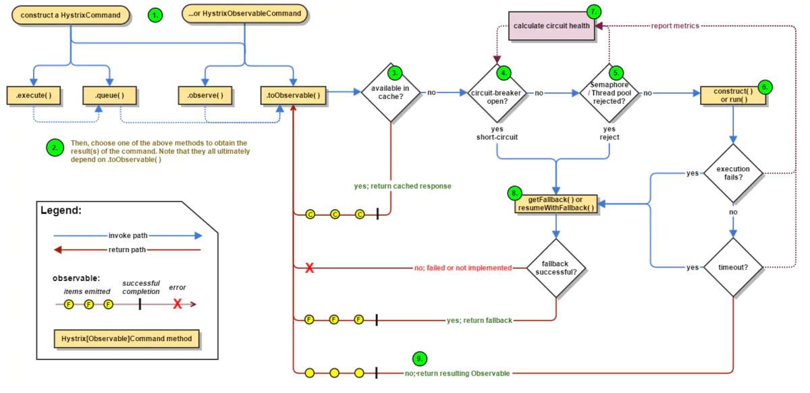

> [官方文档](https://github.com/Netflix/Hystrix/wiki)
## Hystrix的主要功能
1. 线程拆分、隔离
2. 降级、熔断
3. 超时
4. 缓存
5. 监控

增加服务调用方的对外吞吐，对被调用方提供保护

## 线程拆分、隔离
任务线程和请求线程隔离，不同种类任务间也可以使用不同的线程池，相互间隔离。

## 降级
超时、异常、线程池饱和（请求拒绝，不一定是线程池的maximumPoolSize或者blockingQueue的size限制，因为会优先检查`queueSizeRejectionThreshold`，这玩意儿的默认值是5）都会执行降级

```java
public class CommandHelloWorld extends HystrixCommand<String> {

  private final String name;

  public CommandHelloWorld(String name) {
    super(HystrixCommandGroupKey.Factory.asKey("ExampleGroup"));
    this.name = name;
  }

  @Override
  protected String run() {
      // 这里是正常业务
    throw new RuntimeException();
  }

  @Override
  protected String getFallback() {
      // 降级后的内容
      // 1. 如果这里不是固定的内容还有“降级业务”，
      // 需要在这里创建新的command，相当于再加一级。
      // 2. 如果这里“降级业务”是查询缓存一类的低I/O行为
      // 可以考虑使用“信号量”
    return "dummy message";
  }
}
```
## 熔断和恢复逻辑（断路器开闭切换）
`关闭`状态，如果一段时间总的请求数达到`circuitBreaker.requestVolumeThreshold`且失败的请求数大于`circuitBreaker.errorThresholdPercentage`这个百分比，断路器就会进入`打开`状态，打开状态下所有的请求都会直接执行降级逻辑，然后在`circuitBreaker.sleepWindowInMilliseconds`这个时间后会进入`半开`状态，半开状态下会尝试放一个请求，如果：
1. 该请求成功，则会进入`关闭`状态
2. 该请求失败，保持`打开`状态（将当前时间设置为打开时间，再次等待`circuitBreaker.sleepWindowInMilliseconds`进入`半开`）


## Pool配置

### corePoolSize
- > Core thread-pool size that gets passed to ThreadPoolExecutor.setCorePoolSize(int)
- <font color="red">```10 ```</font>

### maximumPoolSize
- > Maximum thread-pool size configured for threadpool. May conflict with other config, so if you need the actual value that gets passed to ThreadPoolExecutor.setMaximumPoolSize(int), use actualMaximumSize(). Given all of the thread pool configuration, what is the actual maximumSize applied to the thread pool via ThreadPoolExecutor.setMaximumPoolSize(int) Cases: 1) allowMaximumSizeToDivergeFromCoreSize == false: maximumSize is set to coreSize 2) allowMaximumSizeToDivergeFromCoreSize == true, maximumSize >= coreSize: thread pool has different core/max sizes, so return the configured max 3) allowMaximumSizeToDivergeFromCoreSize == true, maximumSize < coreSize: threadpool incorrectly configured, use coreSize for max size
- 仅当allowMaximumSizeToDivergeFromCoreSize是true且maximumPoolSize大于coreSize时这里的值为实际传到线程池的maximumPoolSize，否则传到线程池的maximumPoolSize实际大小为coreSize
- <font color="red">```10 ```</font>

### keepAliveTime
- > Keep-alive time in minutes that gets passed to ThreadPoolExecutor.setKeepAliveTime(long, TimeUnit)
- <font color="red">```1 ```</font>

### maxQueueSize
- > Max queue size that gets passed to BlockingQueue in HystrixConcurrencyStrategy.getBlockingQueue(int) This should only affect the instantiation of a threadpool - it is not eliglible to change a queue size on the fly. For that, use queueSizeRejectionThreshold(). -1 turns it off and makes us use SynchronousQueue
- 控制线程池的等待队列大小，不过为了能够在运行时修改这个值，hystrix往隔离线程池提交任务的时候实际参考的是queueSizeRejectionThreshold，这个值默认-1使用SynchronousQueue
- <font color="red">```-1 ```</font>

### queueSizeRejectionThreshold
- > Queue size rejection threshold is an artificial "max" size at which rejections will occur even if maxQueueSize has not been reached. This is done because the maxQueueSize of a BlockingQueue can not be dynamically changed and we want to support dynamically changing the queue size that affects rejections. This is used by HystrixCommand when queuing a thread for execution.
- 实际控制等待队列大小的值，不过如果这个值小于maxQueueSize，那实际生效的还是maxQueueSize
- <font color="red">```5 ```</font>

### allowMaximumSizeToDivergeFromCoreSize
- > should the maximumSize config value get read and used in configuring the threadPool. turning this on should be a conscious decision by the user, so we default it to false.
- <font color="red">```false ```</font>

### threadPoolRollingNumberStatisticalWindowInMilliseconds
- > Duration of statistical rolling window in milliseconds. This is passed into HystrixRollingNumber inside each HystrixThreadPoolMetrics instance.
- 滚动窗口的时间
- <font color="red">```10000 ```</font>

### threadPoolRollingNumberStatisticalWindowBuckets
- > Number of buckets the rolling statistical window is broken into. This is passed into HystrixRollingNumber inside each HystrixThreadPoolMetrics instance.
- 滚动窗口的桶的数量
- <font color="red">``` 10 ``` ```</font>


## Command配置
### circuitBreakerEnabled
- > Whether to use a HystrixCircuitBreaker or not. If false no circuit-breaker logic will be used and all requests permitted. This is similar in effect to circuitBreakerForceClosed() except that continues tracking metrics and knowing whether it should be open/closed, this property results in not even instantiating a circuit-breaker.
- 是否启用熔断，跟circuitBreakerForceClosed的区别就是如果这个关掉的话也不会有统计数据出现
- <font color="red">```true ```</font>

### circuitBreakerErrorThresholdPercentage
- > Error percentage threshold (as whole number such as 50) at which point the circuit breaker will trip open and reject requests. It will stay tripped for the duration defined in circuitBreakerSleepWindowInMilliseconds(); The error percentage this is compared against comes from HystrixCommandMetrics.getHealthCounts().
- 触发断路的请求数量百分比
- <font color="red">```50 ```</font>

### circuitBreakerForceClosed
- > If true the HystrixCircuitBreaker.allowRequest() will always return true to allow requests regardless of the error percentage from HystrixCommandMetrics.getHealthCounts(). The circuitBreakerForceOpen() property takes precedence so if it set to true this property does nothing.
- <font color="red">```false ```</font>

### circuitBreakerForceOpen
- > If true the HystrixCircuitBreaker.allowRequest() will always return false, causing the circuit to be open (tripped) and reject all requests. This property takes precedence over circuitBreakerForceClosed()
- <font color="red">```false ```</font>

### circuitBreakerRequestVolumeThreshold
- > Minimum number of requests in the metricsRollingStatisticalWindowInMilliseconds() that must exist before the HystrixCircuitBreaker will trip. If below this number the circuit will not trip regardless of error percentage.
- 触发断路逻辑的最小阈值，在一个统计窗口内至少有一定数量的请求发生才会走断路判断逻辑
- <font color="red">```20 ```</font>

### circuitBreakerSleepWindowInMilliseconds
- > The time in milliseconds after a HystrixCircuitBreaker trips open that it should wait before trying requests again.
- “半开”的尝试间隔，熔断触发之后在这个时间之后进入“半开”状态，观察请求是否恢复正常
- <font color="red">```5000 ```</font>

### executionIsolationSemaphoreMaxConcurrentRequests
- > Number of concurrent requests permitted to HystrixCommand.run(). Requests beyond the concurrent limit will be rejected. Applicable only when executionIsolationStrategy() == SEMAPHORE.
- 最大的并发请求提交数，只在“信号量”模式下生效
- <font color="red">```10 ```</font>

###  executionIsolationStrategy
- > What isolation strategy HystrixCommand.run() will be executed with. If HystrixCommandProperties.ExecutionIsolationStrategy.THREAD then it will be executed on a separate thread and concurrent requests limited by the number of threads in the thread-pool. If HystrixCommandProperties.ExecutionIsolationStrategy.SEMAPHORE then it will be executed on the calling thread and concurrent requests limited by the semaphore count.
- 隔离策略
- <font color="red">```ExecutionIsolationStrategy.THREAD ```</font>

### executionIsolationThreadInterruptOnTimeout
- > Whether the execution thread should attempt an interrupt (using Future.cancel) when a thread times out. Applicable only when executionIsolationStrategy() == THREAD.
- 超时的时候是否尝试打断执行线程
- <font color="red">```true ```</font>

### executionIsolationThreadInterruptOnFutureCancel
- > Whether the execution thread should be interrupted if the execution observable is unsubscribed or the future is cancelled via Future.cancel(true)). Applicable only when executionIsolationStrategy() == THREAD.
- 取消订阅或者调用future.cancel(true)时是否打断工作线程（结构化并发？）
- <font color="red">```false ```</font>

### executionIsolationThreadPoolKeyOverride
- > Allow a dynamic override of the HystrixThreadPoolKey that will dynamically change which HystrixThreadPool a HystrixCommand executes on. Typically this should return NULL which will cause it to use the HystrixThreadPoolKey injected into a HystrixCommand or derived from the HystrixCommandGroupKey. When set the injected or derived values will be ignored and a new HystrixThreadPool created (if necessary) and the HystrixCommand will begin using the newly defined pool. 
- <font color="red">```null ```</font>

### executionTimeoutInMilliseconds
- > Time in milliseconds at which point the command will timeout and halt execution. If executionIsolationThreadInterruptOnTimeout == true and the command is thread-isolated, the executing thread will be interrupted. If the command is semaphore-isolated and a HystrixObservableCommand, that command will get unsubscribed. 
- <font color="red">```1000 ```</font>

### executionTimeoutEnabled 
- > Whether the timeout mechanism is enabled for this command
- <font color="red">```true ```</font>

### fallbackIsolationSemaphoreMaxConcurrentRequests
- > Number of concurrent requests permitted to HystrixCommand.getFallback(). Requests beyond the concurrent limit will fail-fast and not attempt retrieving a fallback.
- 最大的并发执行fallback的请求数量，超过了就不执行fallback且抛出异常算“执行失败”
- <font color="red">```10 ```</font>

### fallbackEnabled
- > Whether HystrixCommand.getFallback() should be attempted when failure occurs.
- <font color="red">```true ```</font>

### metricsHealthSnapshotIntervalInMilliseconds
- > Time in milliseconds to wait between allowing health snapshots to be taken that calculate success and error percentages and affect HystrixCircuitBreaker.isOpen() status. On high-volume circuits the continual calculation of error percentage can become CPU intensive thus this controls how often it is calculated. 
- 健康快照的执行间隔，健康快照是用来计算成功/失败的百分比的
- <font color="red">```500 ```</font>

### metricsRollingPercentileBucketSize
- > Maximum number of values stored in each bucket of the rolling percentile. This is passed into HystrixRollingPercentile inside HystrixCommandMetrics.
- <font color="red">```100 ```</font>

### metricsRollingPercentileEnabled
- > Whether percentile metrics should be captured using HystrixRollingPercentile inside HystrixCommandMetrics.
- <font color="red">```true ```</font>

### metricsRollingPercentileWindowInMilliseconds
- > Duration of percentile rolling window in milliseconds. This is passed into HystrixRollingPercentile inside HystrixCommandMetrics.
- <font color="red">```60000 ```</font>

### metricsRollingPercentileWindowBuckets
- > Number of buckets the rolling percentile window is broken into. This is passed into HystrixRollingPercentile inside HystrixCommandMetrics.
- <font color="red">```6 ```</font>

### metricsRollingStatisticalWindowInMilliseconds
- > Duration of statistical rolling window in milliseconds. This is passed into HystrixRollingNumber inside HystrixCommandMetrics.
- <font color="red">```10000 ```</font>

### metricsRollingStatisticalWindowBuckets
- > Number of buckets the rolling statistical window is broken into. This is passed into HystrixRollingNumber inside HystrixCommandMetrics.
- <font color="red">```10 ```</font>

### requestCacheEnabled
- > Whether HystrixCommand.getCacheKey() should be used with HystrixRequestCache to provide de-duplication functionality via request-scoped caching.
- <font color="red">```true ```</font>

### requestLogEnabled
- > Whether HystrixCommand execution and events should be logged to HystrixRequestLog.
- <font color="red">```true ```</font>


## 缓存
*实现AbstractCommand中的`getCacheKey()`

（HystrixRequestContext、略）

## 监控
*线程池的配置注意观察rejected数值

（hystrix-metrics-event-stream、略）