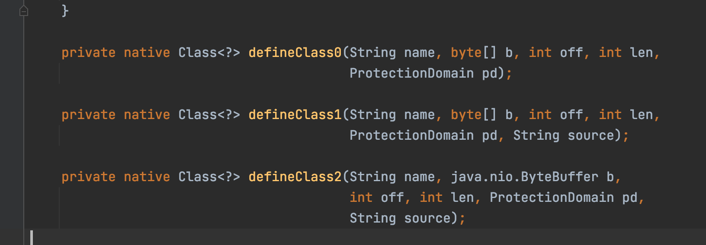
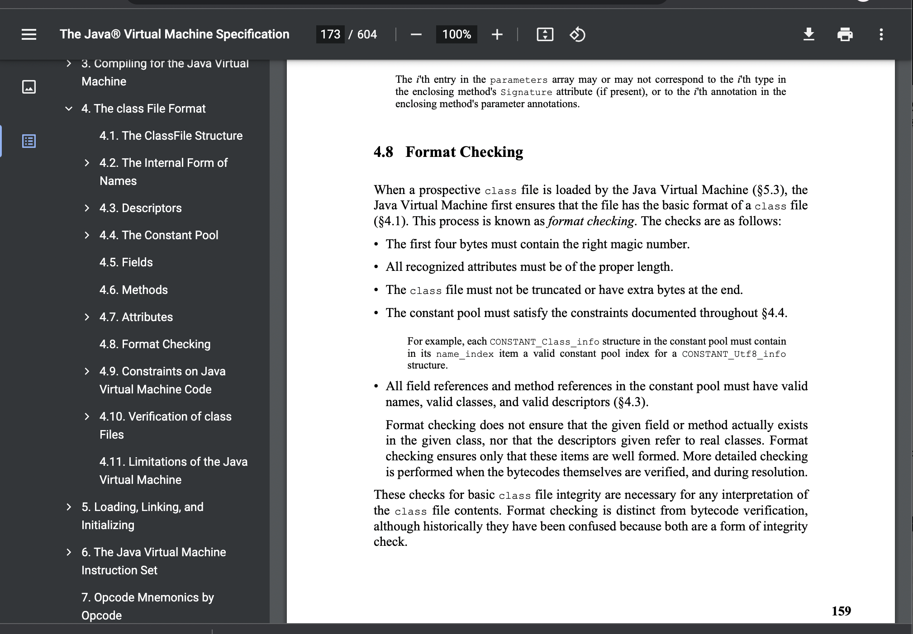
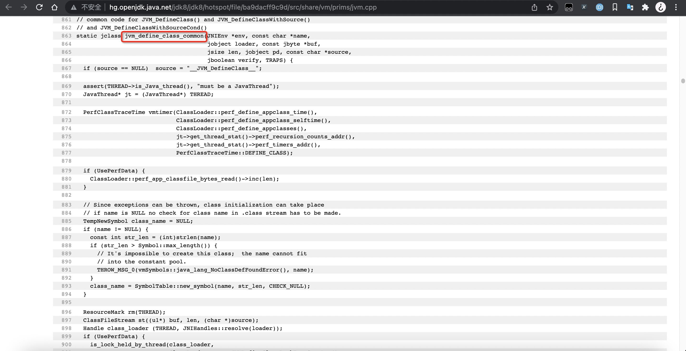
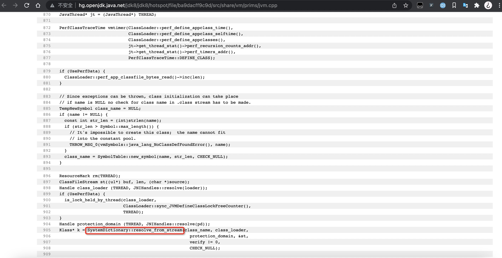
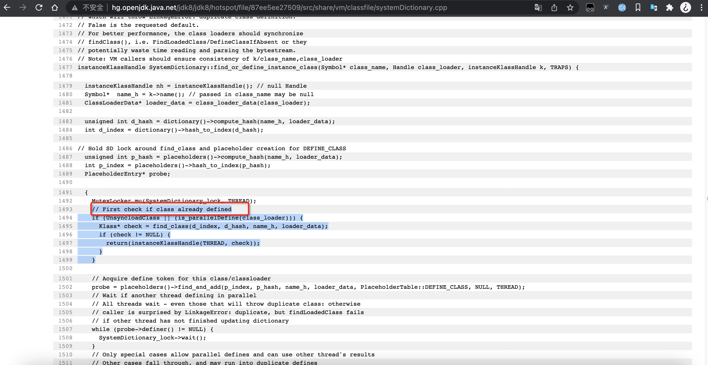
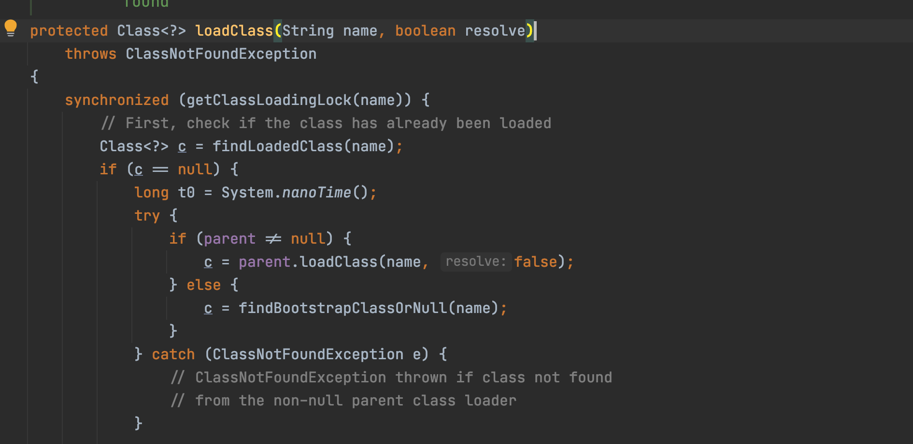
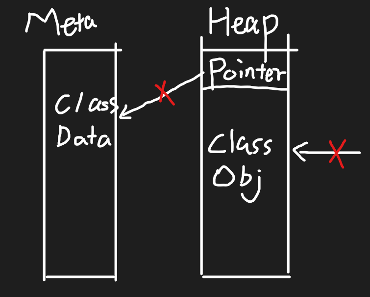

## 现象

通过`ClassLoader#defineClass`方法重复定义指定`name`的类, HotSpot JVM最终会在metaspace中抛出OOM。

## `ClassLoader#defineClass`的行为

`ClassLoader#defineClass`是JVM本地方法, 主要的执行步骤:

1. 解析class文件并检查class文件格式是否正确。
   
   

2. 根据`name`检查`systemDictionary`中class对应的类数据Klass/KlassHandler是否已经加载过。

## HotSpot VM解析class的时候实际行为

在解析和检查class格式过程中, HotSpot VM同时也在metaspace中产生了对应class文件的结构数据 (class code, vtable, itable, etc.)。 所以即使传入的`name`完全一样, 也会在metaspace中不断产生“重复”的class数据。

选择在解析的过程中保留完整的class数据（这里“完整”指的是相对与解析一部分之后丢弃一部分的做法），除了不这么做会增加代码复杂度、增加class数据解析的次数、产生更多的内存碎片之外，另一个考虑是正确且规范的动态类加载方式应该是通过`ClassLoader#loadClass()`来进行，而不是直接调用native方法，因为直接调用native方法并不会得到不一样的结果。

## metaspace中Class数据的GC时机

实际上没有特定针对metaspace的GC行为，GC总是在堆中工作。但当堆中包含metaspace的class数据指针的class对象被执行回收时，class数据占用的空间也会被同时释放。

