## [Heap](https://zh.wikipedia.org/wiki/%E5%A0%86%E7%A9%8D)
[完全二叉树](https://zh.wikipedia.org/wiki/%E5%AE%8C%E5%85%A8%E4%BA%8C%E5%8F%89%E6%A0%91)，且任意一个点的父节点都大于（小于）子节点。

## Max Heap & Min Heap
最大/最小堆指的是堆顶（根节点）是最大还是最小。

## 实现

### 数据结构
堆也是完全二叉树，所以除了可以用节点/指针的方式来实现：
```java
class Heap{
    Node root;
}

class Node{
    int val;
    Node left;
    Node right;
}
```
也可以用数组来实现：
```java
class Heap{
    int[] values;
}
```
用数组实现时：

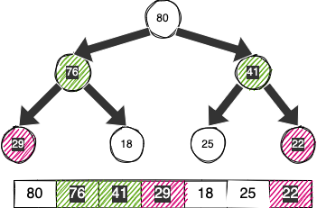

父子节点的位置关系：
```java
int parentOffset(int childOffset){
    return childOffset / 2;
}

int leftChildOffset(int parentOffset){
    return parentOffset * 2 + 1;
}

int rightChildOffset(int parentOffset){
    return parentOffset * 2 + 2;
}
```

### 插入
从尾部插入，然后跟父节点比较，不满足最大（最小）二叉堆性质则交换位置直到满足性质或者达到最顶部：

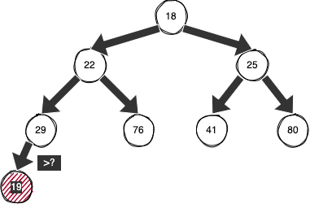

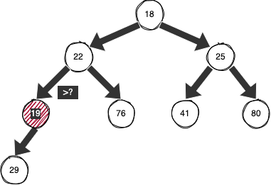

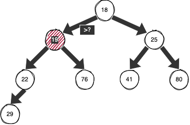

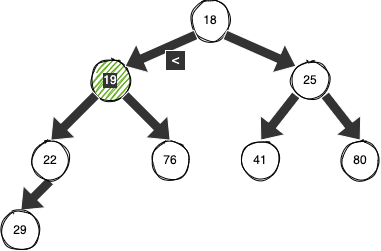

```java
// min heap
void insert(int val){
    if(isFull()) resize();
    int offset = size, parentOffset = parentOffset(offset);
    // 先插入到尾部
    values[offset] = val;
    // 与父节点对比交换
    while(values[parentOffset] > value[offset]){
        // sift(int, int)
        int tmp = values[parentOffset];
        values[offset] = tmp;
        values[parentOffset] = val;
    }
    size++;
}

// 扩容
void resize(){
    // ...
}
```

插入的元素从底部向上的这个过程可以称作：percolate up（上滤）

### 删除顶部
删除顶部节点后需要重新调整原来的子树，比如：

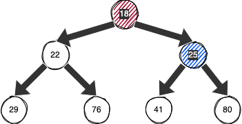

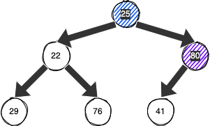

每次移动节点的时候会出现空缺，原来的子节点都需要比较然后向前移动，比较麻烦，那么可以换种策略，在删除顶部节点后将最后一个节点移动到顶部，然后从上向下比较交换节点直到恢复堆性质：

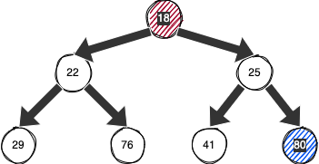

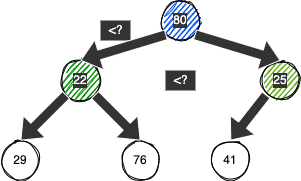

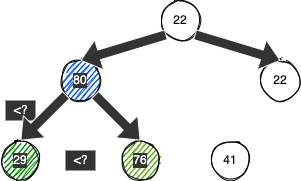

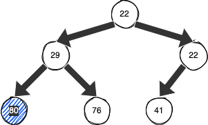

从上向下比较交换的时候需要同时比较左右两个字节点，要与两个字节点中最小（最大）的交换来恢复堆性质。

```java
// min heap
int deleteMin(){
    if(isEmpty()) return -1;
    // 将尾部插入到顶部
    int offset = 0, leftChildOffset = -1, rightChildOffset = -1;
    int min = values[offset];
    values[offset] = values[size - 1];
    // 和左右子节点对比交换
    // *note: 这里要校验是否存在左右节点
    while(values[offset] > values[(leftChildOffset = leftChildOffset(offset))] ||
        values[offset] > values[(rightChildOffset = rightChildeOffset(offset))]){
            if(values[leftChildOffset] > values[rightChildOffset]){
                // 左<右
                if(values[leftChildOffset] > values[offset]){
                    // 左<顶
                    sift(offset, leftChildOffset);
                    offset = leftChildOffset;
                }
            }else{
                // 右<左
                if(values[rightChildOffset] > values[offset]){
                    // 右<顶
                    sift(offset, rightChildOffset);
                    offset = rightChildOffset;
                }
            }
    }
    size--;
    return min;
}

// 交换元素
void sift(int offset, int otherOffset){
    // ...
}
```

删除顶部元素的这个从顶部向下交换的过程称作：percolate down（下滤）
