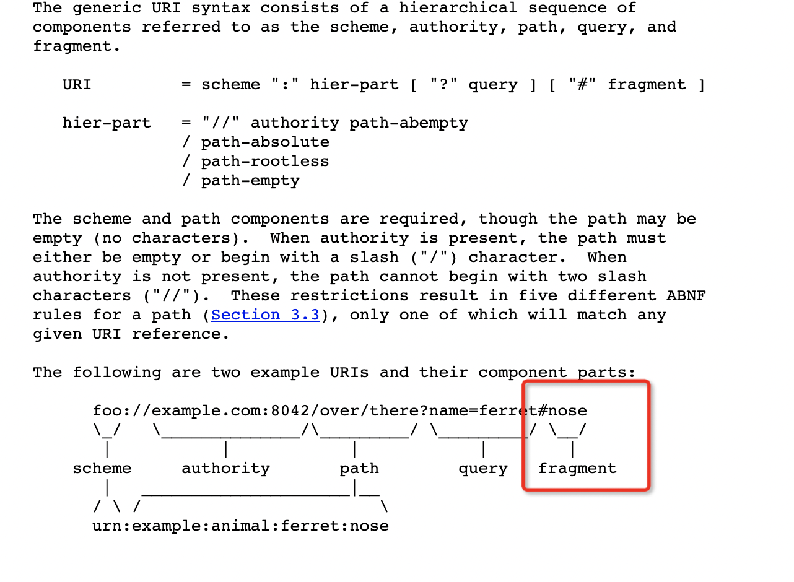
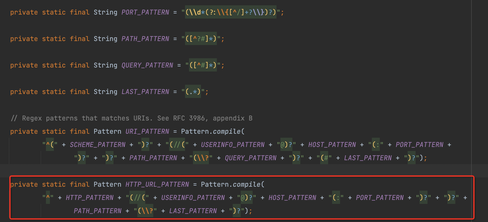
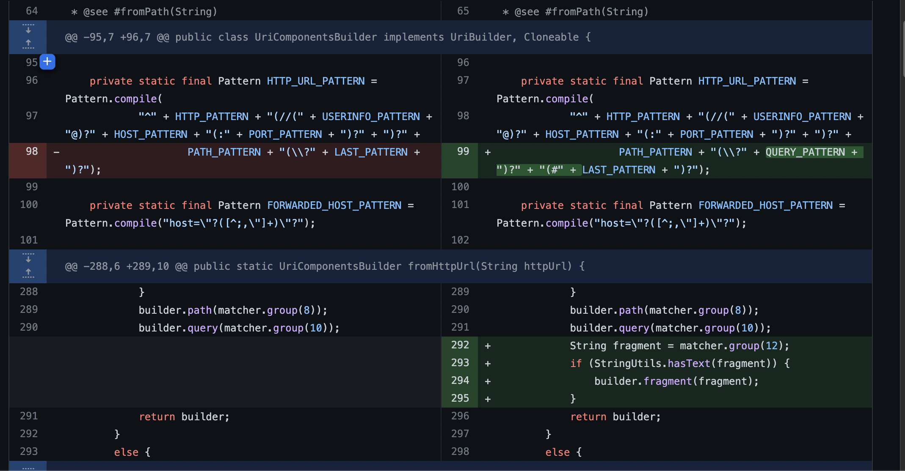

## 现象
用[UriComponents](/2022/06/14/useful-utils/index.html#UriComponents)解析url的时候报`IllegalArgumentException`。

传入解析的url：`www.xxxx.com/p#/f`，特点是带上了fragment`#/f`

* [RFC3986](https://datatracker.ietf.org/doc/html/rfc3986)

### 原因

`fromHttpUrl(String)`的匹配规则是：
- PATH部分不允许'?'或'#'出现
- '?'后作为一个整体

也就是`www.xxxx.com/p#/f`里`/p`被解析为了path部分，`#/f`是不合法的部分。而`www.xxxx.com/p?#/f`这种是可以的，其中`?#/f`被解析为一个整体。

[ISSUE#25300](https://github.com/spring-projects/spring-framework/issues/25300) : Support fragments in UriComponentsBuilder.fromHttpUrl() 

在`5.2.8.RELEASE`中spring已经将修复代码合并：

## 解决

1. 升级spring到5.2.8.RELEASE及以上版本
2. 用`fromUriString(String)`替换`fromHttpUrl(String)`，schema的部分自行判断一下